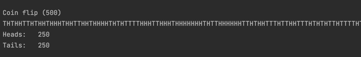

## A Introduction
#### A.1 Test for the following prime numbers:
* 91: Result `No`
* 421: Result `Yes`
* 1449: Result `No`

#### A.2 Determine the GCD for the following:
* 88, 46: `2`
* 105, 35: `35`

#### A.3 Determine the Base 64 and Hex values for the following strings:
* Hello:  `Base-64: SGVsbG8= Hex: 48656C6C6F`
* hello: `Base-64: aGVsbG8= Hex: 68656C6C6F`
* HELLO: `Base-64: SEVMTE8= Hex: 48454C4C4F`

#### A.4 Determine the following ASCII strings for these encoded formats:
* bGxveWRz: `lloyds`
* 6E6170696572: `napier`
* 01000001 01101110 01101011
01101100 01100101 00110001
00110010 00110011: `Ankle123`

#### A.5 Using Python, what is the result of 53,431 (mod 453)?
Results: `430`

#### A.6 Using Python, what is the results of the following:
```
print (0x43 | 0x21)
print (0x43 & 0x21)
print (0x43 ^ 0x21)
```
Results:
```
99
1
98
```

#### A.7 Using Python, what is the hex, octal, character, and binary equivalents of the value of 93:
```
Dec:    93
Hex:    0x5d
Oct:    0o135
Char:   ]
Bin:    0b1011101
```

#### A.8 JavaScript is often used in cryptography. Using node.js, repeat A.7
Results:
```
1011101
5d
135
]
```

#### A.9 Using Python, what is the Base-64 conversion for the string of “crypto”?
```
b'Y3J5cHRv'
```

#### A.10 If we use a string of “crypto1”, what do you observe from the Base64 conversion compared to the result in the previous question (A.9)?
Observation: The result is the same for the first characters as we extend it: `b'Y3J5cHRvMQ=='
` 

#### A.11 Using Python, using a decimal value of 41, determine the result of a shift left by one bit, a shift left by two bits, a right shift by one bit, and a right shift by two bits:
```
Binary form:  		00101001
Decimal form:  		41 	00101001
Shift left  (1):	82 	01010010
Shift left  (2):	164 	10100100
Shift right (1):	20 	00010100
Shift right (2):	10 	00001010
```
#### Why would a shift left or shift right operator not be used on its own in cryptography?
Because it is too easy for the operation to be reversed.

#### A.12 In several cases in cryptography, we try and factorize a value into its factors. An example is 15, and which has factors of 5 and 3. Using the Python program defined in the following link, determine the factors of 432:
Result: `432 = 2 x 2 x 2 x 2 x 3 x 3 x 3`

Think of two extremely large values and determine their
factors:
* 9876543210: `2 x 3 x 3 x 5 x 17 x 17 x 379,721`
* 102030405060708090: `2 x 3 x 3 x 5 x 83 x 102,241 x 133,593,067`

#### A.13 Determine what the following Base64 conversions are when they are uncompressed
* eJzzyc9Lyc8DAAgpAms= `London`
* eJxzSi3KycwDAAfXAl0= `Berlin`
* eJzzSy1XiMwvygYADKUC8A= `New York`

## B GCD
### B.1 Write a Python program to determine the GCD for the following:
```
4105 and 10: 5
4539 and 6: 3
```

### B.2 Determine if the following values are coprime:
* 5435 and 634: `Yes`
* 5432 and 634: `No`


## C Modulus and Exponentiation
#### C.1 What is the result of the following:
* 8^13 mod 271: `119`
* 12^23 mod 973: `514`

#### C.2 Is the result of 85 mod 269 equal to 219?
```
Is the result of 8^5 mod 269 equal to 219?
Yes
```

#### C.3 Now prove the following:
* (a) message = 5, e=5, p = 53. Ans: 51 `Yes`
* (b) message = 4, e=11, p = 79. Ans: 36 `Yes`
* (c) message = 101, e=7, p = 293. Ans: 176 `Yes`

## D Simple prime number test
#### D.1 Using the equation of 6k ± 1. Determine the prime numbers up to 100:
Prime numbers:
``` 
2 3 5 7 11 13 17 19 23 29 31 37 41 43 47 53 59 61 67 71 73 79 83 89 97 
```

#### D.2 Implement a Python program which will calculate the prime numbers up to 1000:
Define the highest prime number
generated: `997`

#### D.3 Implement the Python code given above and determine the highest prime number possible in the following ranges:
* Up to 100: `97`
* Up to 1,000: `997`
* Up to 5,000: `4999`
* Up to 10,000: `9973`

#### D.4 Which of the following numbers are prime numbers:
* Is 5 prime? `Yes`
* Is 7919 prime? `Yes`
* Is 858,599,509 prime? `Yes`
* Is 982,451,653 prime? `Yes`
* Is 982,451,652 prime? `No`

## E Random Numbers
#### E.1 Implement the python sequence
Does it generate the sequence? `Yes`

#### E.2 Determine the sequence for:
a=22, seed=35, c=31, and m=100

`First four numbers: 1 53 97 65`

#### E.3 Determine the sequence for:
a=954,365,343, seed=436,241,
c=55,119,927, and m=1,000,000

`First four numbers: 715590 917297 157798 514641`

#### E.4 Determine the sequence for:
a=2,175,143, seed=3553, c=10,653, and
m=1,000,000.

`First four numbers: 293732 114329 934700 172753`


Using the Python program to select Head or Tails, create a run for 500 tosses (perhaps
running it a few times and noting the balance of Heads and Tails), and show that program is
unlikely to be biased towards Heads or Tails?


There is the same number of heads and tails, therefore it is unlikely that it is biased towards
heads or tails.

## F Breaking the Shift Cipher
#### Decrypt the following ciphertext using a brute force attack
* ymnx nx ymj ktwjxy uwnrjafq: 
  * `Text: this is the forest primeval Key: 20`
* esp bflwtej zq xpcnj td yze decltypo}:
  * `Text: the quality of mercy is not strained} Key: 14`
* owlzwhwghdwgxlzwmfalwvklslwk
  * `Text: wethepeopleoftheunitedstates Key: 7`
* haahjr ha khdu
  * `Text: attack at dawn Key: 18`
* wkh srufxslqh lv xqghu wkh vkhhwv
  * `Text: the porcupine is under the sheets Key: 22`
* WKH TXLFN EURZQ IRA MXPSV RYHU WKH ODCB GRJ
  * `THE QUICK BROWN FOX JUMPS OVER THE LAZY DOG Key: 22`

## G Breaking the Mono-alphabetic Substitution Cipher
Decrypting the following ciphertext:

```
nkutf qmoio cop o cuqwfu gukr fmyojku, lfpw sekce gku zqp ekhfb zyopqxyetk,
czqmz lukytzw owwfewqke wk wzf fvxbkqwowqke kg fmyojku'p qejqtfekyp
xfkxbf la fmyojkuqoe czqwfp. cqwz wzf xylbqmowqke kg zyopqxyetk, qmoio
omzqfhfj qewfueowqkeob gorf. wzf lkks lfmorf o cfbb-sekce "qejqtfeqpw" ekhfb,
o rkhfrfew qe bowqe orfuqmoe bqwfuowyuf wzow opxqufj wk ufobqpr qe qwp
jfxqmwqke kg wzf rqpwufowrfew kg wzf qejqtfekyp.
```
Steps:
1. The fifth word 'o' is only a letter. In english, the common letter that is also a word is 'a'.
The most frequent word is 'wzf', which we assume is 'the'.

```
nkutE qmAiA cAp A cuqTEu gukr EmyAjku, lEpT sekce gku Hqp ekhEb HyApqxyetk,
cHqmH lukytHT ATTEeTqke Tk THE EvxbkqTATqke kg EmyAjku'p qejqtEekyp
xEkxbE la EmyAjkuqAe cHqTEp. cqTH THE xylbqmATqke kg HyApqxyetk, qmAiA
AmHqEhEj qeTEueATqkeAb gArE. THE lkks lEmArE A cEbb-sekce "qejqtEeqpT" ekhEb,
A rkhErEeT qe bATqe ArEuqmAe bqTEuATyuE THAT ApxquEj Tk uEAbqpr qe qTp
jExqmTqke kg THE rqpTuEATrEeT kg THE qejqtEekyp.
```

2. The word 'lkks' has two 'kk' in the middle. In the english language, it is common
for a word to have the letters 'ee' or 'oo'. Therefore, we replace 'k' by 'o'.

```
nOutE qmAiA cAp A cuqTEu guOr EmyAjOu, lEpT seOce gOu Hqp eOhEb HyApqxyetO,
cHqmH luOytHT ATTEeTqOe TO THE EvxbOqTATqOe Og EmyAjOu'p qejqtEeOyp
xEOxbE la EmyAjOuqAe cHqTEp. cqTH THE xylbqmATqOe Og HyApqxyetO, qmAiA
AmHqEhEj qeTEueATqOeAb gArE. THE lOOs lEmArE A cEbb-seOce "qejqtEeqpT" eOhEb,
A rOhErEeT qe bATqe ArEuqmAe bqTEuATyuE THAT ApxquEj TO uEAbqpr qe qTp
jExqmTqOe Og THE rqpTuEATrEeT Og THE qejqtEeOyp.
```

3. It is easy to see 'gOu' is 'FOR'.
``` 
nORtE qmAiA cAp A cRqTER FROr EmyAjOR, lEpT seOce FOR Hqp eOhEb HyApqxyetO,
cHqmH lROytHT ATTEeTqOe TO THE EvxbOqTATqOe OF EmyAjOR'p qejqtEeOyp
xEOxbE la EmyAjORqAe cHqTEp. cqTH THE xylbqmATqOe OF HyApqxyetO, qmAiA
AmHqEhEj qeTEReATqOeAb FArE. THE lOOs lEmArE A cEbb-seOce "qejqtEeqpT" eOhEb,
A rOhErEeT qe bATqe ArERqmAe bqTERATyRE THAT ApxqREj TO REAbqpr qe qTp
jExqmTqOe OF THE rqpTREATrEeT OF THE qejqtEeOyp.
```

4. From 'cRqTER' we get 'WRITER' and 'FROr' is 'FROM'.
``` 
nORtE ImAiA WAp A WRITER FROM EmyAjOR, lEpT seOWe FOR HIp eOhEb HyApIxyetO,
WHImH lROytHT ATTEeTIOe TO THE EvxbOITATIOe OF EmyAjOR'p IejItEeOyp
xEOxbE la EmyAjORIAe WHITEp. WITH THE xylbImATIOe OF HyApIxyetO, ImAiA
AmHIEhEj IeTEReATIOeAb FAME. THE lOOs lEmAME A WEbb-seOWe "IejItEeIpT" eOhEb,
A MOhEMEeT Ie bATIe AMERImAe bITERATyRE THAT ApxIREj TO REAbIpM Ie ITp
jExImTIOe OF THE MIpTREATMEeT OF THE IejItEeOyp.
```
5. 'WAp' must be 'WAS'. 'WHImH' is 'WHICH'. 'AMERImAe' is 'AMERICAN'

``` 
nORtE ICAiA WAS A WRITER FROM ECyAjOR, lEST sNOWN FOR HIS NOhEb HyASIxyNtO,
WHICH lROytHT ATTENTION TO THE EvxbOITATION OF ECyAjOR'S INjItENOyS
xEOxbE la ECyAjORIAN WHITES. WITH THE xylbICATION OF HyASIxyNtO, ICAiA
ACHIEhEj INTERNATIONAb FAME. THE lOOs lECAME A WEbb-sNOWN "INjItENIST" NOhEb,
A MOhEMENT IN bATIN AMERICAN bITERATyRE THAT ASxIREj TO REAbISM IN ITS
jExICTION OF THE MISTREATMENT OF THE INjItENOyS.
```

6. 'MOhEMENT' is 'MOVEMENT', 'lEST' is 'BEST'. 'xylbICATION' is 'PUBLICATION'.
```
nORtE ICAiA WAS A WRITER FROM ECUAjOR, BEST sNOWN FOR HIS NOVEL HUASIPUNtO,
WHICH BROUtHT ATTENTION TO THE EvPLOITATION OF ECUAjOR'S INjItENOUS
PEOPLE Ba ECUAjORIAN WHITES. WITH THE PUBLICATION OF HUASIPUNtO, ICAiA
ACHIEVEj INTERNATIONAL FAME. THE BOOs BECAME A WELL-sNOWN "INjItENIST" NOVEL,
A MOVEMENT IN LATIN AMERICAN LITERATURE THAT ASPIREj TO REALISM IN ITS
jEPICTION OF THE MISTREATMENT OF THE INjItENOUS.
```

7. 'ECUAjOR' is 'ECUADOR'. 'sNOWN' is 'KNOWN'. 'HUASIPUNtO' is 'HUASIPUNGO'. 
The rest of the letters are easy enough to infer.
``` 
JORGE ICAZA WAS A WRITER FROM ECUADOR, BEST KNOWN FOR HIS NOVEL HUASIPUNGO,
WHICH BROUGHT ATTENTION TO THE EXPLOITATION OF ECUADOR'S INDIGENOUS
PEOPLE BY ECUADORIAN WHITES. WITH THE PUBLICATION OF HUASIPUNGO, ICAZA
ACHIEVED INTERNATIONAL FAME. THE BOOK BECAME A WELL-KNOWN "INDIGENIST" NOVEL,
A MOVEMENT IN LATIN AMERICAN LITERATURE THAT ASPIRED TO REALISM IN ITS
DEPICTION OF THE MISTREATMENT OF THE INDIGENOUS.
```